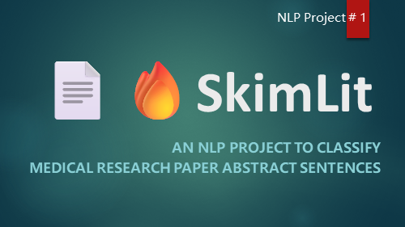
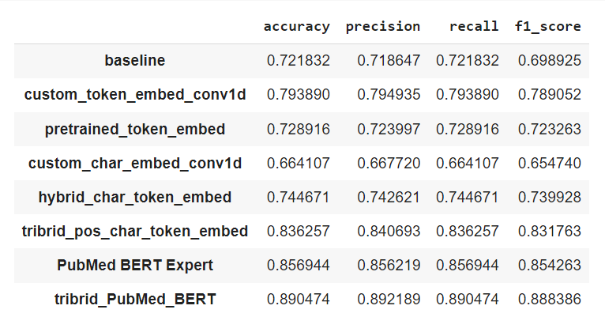
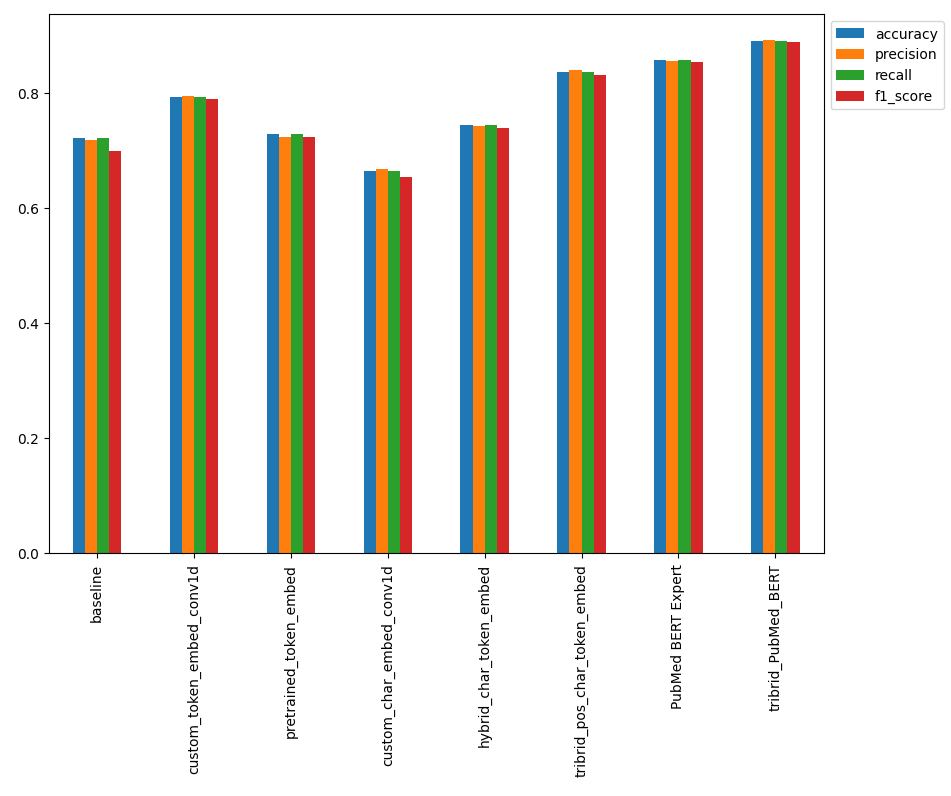
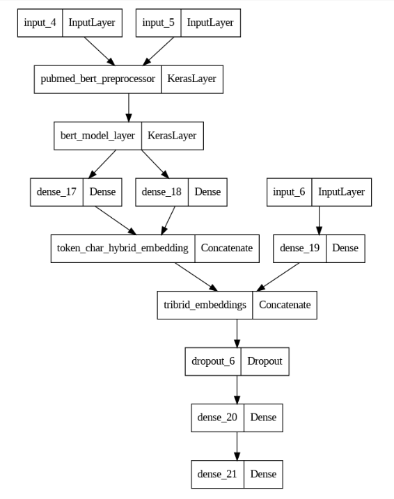
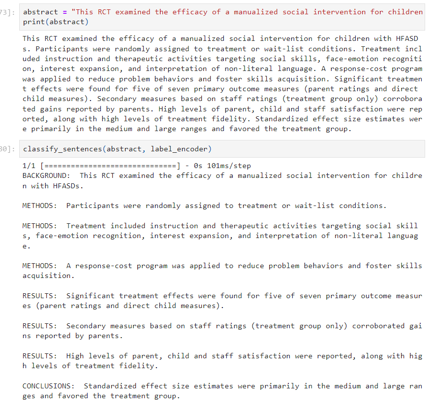

> 

In this project, I am going to replicate the deep learning model behind the 2017 paper [PubMed 200k RCT: a Dataset for Sequential Sentence Classification in Medical Abstracts](https://arxiv.org/pdf/1710.06071.pdf) & [Neural networks for joint sentence classification in medical paper abstracts.](https://arxiv.org/pdf/1612.05251.pdf)

In the process of replicating the model in the paper, I am also going to experiment by creating multiple other models.

The paper PubMed 200k RCT presented a new dataset consisting of ~2,00,000 labelled Randomized Controlled Trial (RCT) abstracts and the goal of the dataset was to explore the ability for NLP models to classify sentences which appear in sequential order.

## Problem Statement
The number of RCT papers released is continuring to increase, those without structured abstracts can be hard to read and in turn slow down researchers moving through the literature.

### Solution
Create an NLP model to classify abstract sentences into the role they play (e.g. Background, Objective, Methods, Result and Conclusion etc.) to enable reseachers to skim through the literature and dive deeper when necessary.

1. Data: [PubMed 200k RCT: a Dataset for Sequential Sentence Classification in Medical Abstracts](https://arxiv.org/pdf/1710.06071.pdf)
2. Model: [Neural networks for joint sentence classification in medical paper abstracts](https://arxiv.org/pdf/1612.05251.pdf)

## Approach of execution

- Download a text dataset from Github https://github.com/Franck-Dernoncourt/pubmed-rct
- Writing a preprocessing function to prepare our data for modelling
- Setting up a series of modelling experiments
  - Making a baseline (TF-IDF / Naive Baye's Classifier)
  - Deep Learning models with different combinations of: token embeddings, character embeddings, pretrained embeddings, positional embeddings
- Building first multimodal model (taking multiple types of data inputs)
  - Replicating the model architecture from paper [Neural networks for joint sentence classification in medical paper abstracts](https://arxiv.org/pdf/1612.05251.pdf)
- Building another tribrid model using PubMed BERT Expert
- Making predictions on PubMed abstracts from the wild

## Results

> 
> 

## Best Model Structure
- Achieved an accuracy of ~88% on tribrid model with PubMed BERT Expert and layers including token-level embeddings, character-level embeddings and positional embeddings.
> 

## Demo -> How our model classifies Abstract sentences

> 